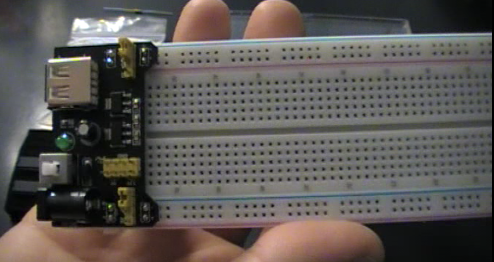
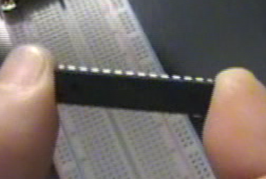
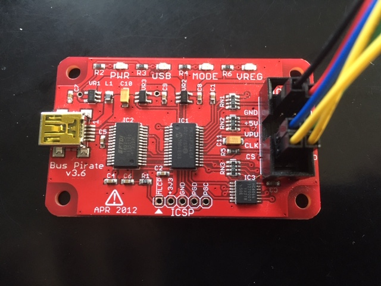
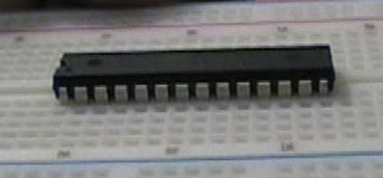

# AVR-tutorial
Easy-to-grasp, step-by-step tutorials for creating firmware for the AVR family of microprocessors.

## Lesson 0: Lab Setup

### What you'll need

||||
|--|--|--|
|Breadboard|Microprocessor|BusPirate|

1. Breadboard/prototyping board and power supply. These are usually sold together.
1. Atmel (now Microchip) AVR processor. I use the ATmega88, but others will work fine. Older or second-hand ones are usually cheaper
and plentiful. Optionally, also pick up a chip socket. If you need to remove the chip later, and the socket's pins are broken,
it's not as big a deal to replace the socket.
1. The processor's datasheet. These are readily available on Microchip's site; either go to the site and search, or simply 
type e.g. "ATmega88 datasheet" into your search engine of choice. This is the spec you'll work with to find out how to work
with the chip, which pins are for what, etc. There are also [application notes]() on how to do common tasks, 
such as [read keyboard input](http://www.microchip.com//wwwAppNotes/AppNotes.aspx?appnote=en591996) or how to [optimize
C code](http://www.microchip.com//wwwAppNotes/AppNotes.aspx?appnote=en591830) for AVR use.
1. Programmer (I use [BusPirate](http://dangerousprototypes.com/docs/Bus_Pirate) and [AVRDUDE](https://www.nongnu.org/avrdude).
There are other ways of getting a binary onto a chip, including DIY circuits.
1. Jumper wires.
<!--1. A light emitting diode, or LED.
1. A resistor to protect the LED from the full current of the power supply.-->

All of these are cheap and easy to find. AVRDUDE is free from the above link.

### Setup
1. Attach the power supply to the breadboard.
1. If adjustable, set the voltage on the breadboard to 3.3 V.
1. Ground yourself by touching anything metal. Preferably, use a grounding strap attached to your wrist or workspace. The 
microscopic components within a microchip can be destroyed by static discharges.
1. Check that the pins on the microchip are straight. If any are bent, carefully straighten them.
1. Ease the chip's pins into the holes near the middle of the breadboard, such that the chip is straddling the channel 
bisecting the breadboard lengthwise. Gently press the chip down until its bottom touches the breadboard.

1. Find the pinout diagram in the chip's datasheet (make sure you're looking at the right chip format and number) and 
look for the two power pins: VCC (+) and GND (-). There are probably a couple of pairs depending on the chip you're using.
The GND you use doesn't matter, and there will probably be one on each side to make life easier. Be sure you don't use AVCC 
for the (+); this is used for the analog-to-digital conversion functionality of some chips. For the ATmega 88, Pin 7 is
VCC, and Pin 8 is GND. Use jumper wires to connect these to (+) and (-) on the power supply rails, respectively.
1. Use jumper wires to connect BusPirate to the appropriate pins on the chip. For the ATmega88, these are:

|BusPirate|Chip name|ATmega88 pin|
|--|--|--|
| GND  | GND   |  8 |
| 3V3  | VCC   |  7 |
| CLK  | SCK   | 19 |
| CS   | RESET |  1 |
| MOSI | MOSI  | 17 |
| MISO | MISO  | 18 |

1. Connect BusPirate to the computer with a USB cable.
1. Download and install AVRDUDE. For best results, boot into your favorite flavor of Linux, and install it from your 
distribution's repository. (If you're not already running Linux, get out. Joking, of course. I can point you to 
myriad guides that will show you how to make a computer truly useful)
1. Test the connection: open a Terminal, and as root enter: `avrdude -c buspirate -P /dev/ttyUSB0 -p m88p`

There you go, your very own lab setup! Now it's time to move on to the [next lesson](01-01-LED-light) (if not available yet, keep your eyes open)!

As always, please send questions, corrections, and/or snide remarks to xenloops at protonmail dot com or @zenloops on Twitter.

