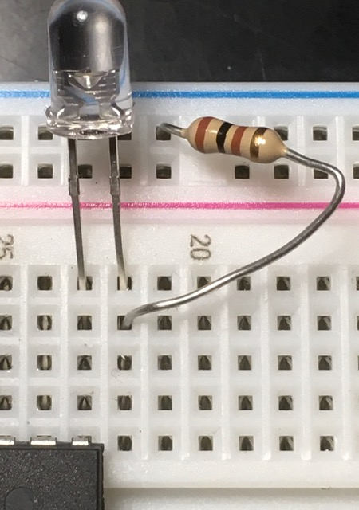

# AVR-tutorial
Easy-to-grasp, step-by-step tutorials for creating firmware for the AVR family of microprocessors.

## Season 1, Lesson 1: You light up my life

### What you'll need

||||
|--|--|--|
|Breadboard|Microprocessor|BusPirate|

1. Everything in [Lesson 0](00-00-lab-setup.md).
1. A light emitting diode, or LED.
1. A resistor to protect the LED from the full current of the power supply.

Please note that you really do want to protect your LEDs. LEDs may be cheap (hopefully you're not using some expensive 5 MW LED that turns night into day for this), but it's all too easy to burn out an LED, only to find you've burned through your entire stash. (Burning out components is part of the learning curve for EEs, so don't fret when you do it.) If you purchased yours, they should come with some specs on the package. All you need is to divide the difference between the supplied voltage and LED's forward voltage by the LED's forward current (in amps). There are also free LED resistor calcuators you can search for; I like [ledcalculator.net](https://ledcalculator.net) for its simplicity and completeness. If you pulled your LED out of some derelict device or just don't know its specs, toss in a low-ohm resistor -- you still want it to light.

### Setup
#### Hardware
1. Do everything in [Lesson 0](00-00-lab-setup.md).
1. Grab your LED and insert its leads between the PB1 pin on the processor (pin 15 on the ATmega88) and the adjacent unused hole on the breadboard (but not a power rail).
1. Stick the resistor between the LED and the negative power rail.

Your breadboard should look something like this:

#### Firmware
Yes, that's right. Software is what code written for the desktop, web sites, and mobile apps is turned into. Firmware is what the black magic awesomeness you're about to write gets compiled into, destined for uploading (or flashing) to run on an actual chip -- without all that mucking about with runtime interpreters or operating systems. This is the big time, my friend.
1. Download the code from [Code 01-01](code/01-01.c) and save it to a convenient directory. Take a look at the code. This one's simple and commented, but you should start to get a feel for how it's done.
1. Open a Terminal in the directory holding the code. Oh yes, a Terminal. No wimpy IDEs or childish GUIs for you, you're going hard core unto the breach. Don't worry, you got this.
1. Enter the following to compile your C file: 
`avr-gcc -g -Os -mmcu=atmega88 -c 01-01.c`
1. Assuming all went well, you won't see anything but a new prompt appear. Now do the linking:
`avr-gcc -g -mmcu=atmega88 -o 01-01.elf 01-01.o`
1. Again if all went well, you won't see anything but a new prompt appear. Now turn it into a flashable binary:
`avr-objcopy -j .text -j .data -O ihex 01-01.elf 01-01.hex`
1. Finally, make sure BisPirate and your breadboard are connected and powered. Flash the firmware:
`sudo avrdude -c buspirate -P /dev/ttyUSB0 -p m88p -U flash:w:01-01.hex`
1. After the [blinkenlights](https://en.wikipedia.org/wiki/Blinkenlights) are finished on BusPirate, you should be able to run the program. Power the breadboard and the LED should light, but not just because you applied power -- the chip is running your code, which is lighting the LED. Your code actually changed soemthing in the physical world!

Now it's time to move on to the [next lesson](01-02-LED-button.md) (if not available yet, keep your eyes open)!

As always, please send questions, corrections, and/or snide remarks to xenloops at protonmail dot com or @xenloops on Twitter.

