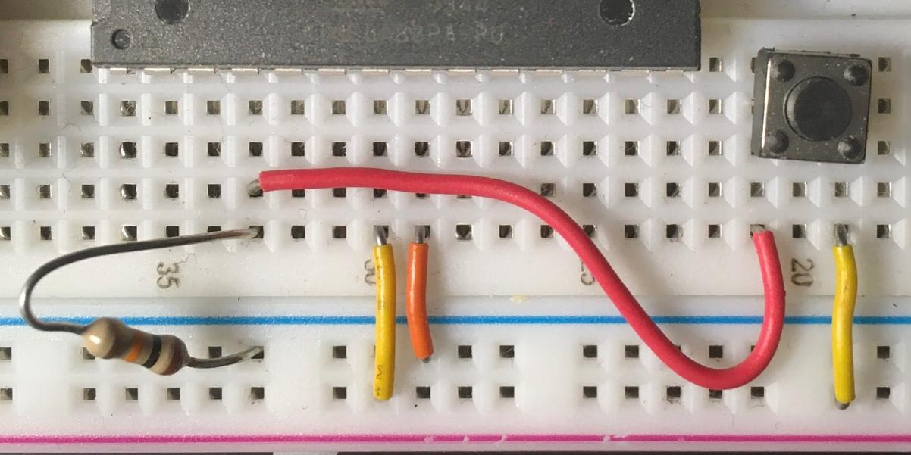

# AVR tutorial
Easy-to-grasp, step-by-step tutorials for creating firmware for the AVR family of microprocessors.

## Season 1, Lesson 3: Interruptions

### What you'll need

1. Everything in [Lesson 2](01-02-LED-button.md).

You no doubt noticed that the button-light behavior in Lesson 2 is a bit off; there's no way we'd put up with that in a production device. Imagine if every time you typed a character on your laptop there was a roughly 65% chance the character would appear on screen. Well, take heart: there is a simple solution: interrupts.

Interrupts are exactly what they sound like: no matter what the processor is doing, when it "sees" an interrupt it will stop that activity and do whatever the interrupt code specifies, then go back to the original activity. It's kind of like what you might experience on any given weekend: you're in the middle of a good book, when the kids start screaming bloody murder at each other. You have to remember what paragraph you were reading, save the page, and go try to resolve whatever earth-shattering crisis is going on just now. When you've taken care of that, go back to your book and resume reading from where you were so rudely interrupted.

### Setup
#### Hardware
1. Do everything in [Lesson 2](01-02-LED-button.md), except this time:
1. Connect one side of the switch to PD2 (Pin 4 on the ATMega88), and the other side to the positive power rail.
1. Connect the resistor between PD2 and the negative power rail.

Yes, this means connecting the switch in the reverse way from the previous lesson. I'm just trying to keep you on your toes. (Also -- when you're done with this, try changing polarity on the switch and running the same firmware; figure out why the behavior changes.)

Your breadboard should look something like this:

#### Firmware
1. Download the code from [Code 01-03](code/01-03.c) and save it to your AVR development directory. Take a look at the code. This one is also simple and commented; pay special attention to the interrupt handling.
1. Open a Terminal in the directory holding the code.
1. As in previous lessons, enter the following commands in order: 

   `avr-gcc -g -Os -mmcu=atmega88 -c 01-03.c`
   
   `avr-gcc -g -mmcu=atmega88 -o 01-03.elf 01-03.o`
   
   `avr-objcopy -j .text -j .data -O ihex 01-03.elf 01-03.hex`
   
   `sudo avrdude -c buspirate -P /dev/ttyUSB0 -p m88p -U flash:w:01-03.hex`

Power the breadboard and press the button. The LED should be a lot more responsive than before. (It's not perfect, but we can deal with that later. It's a common problem with spurious signals from physical devices like buttons that can be remedied in code by a process called debouncing.) Voila, the magic of interrupts!

### More about the firmware
To get interrupts working, we need to do a bit more prep work and introduce some new code. The button is already connected to INT0, an external interrupt sensitive pin.

`cli();` disables all interrupts while we're making changes (*CL*ear *I*nterrupt)

`SETBIT(EICRA, ISC00);` These two tell the chip that the rising

`SETBIT(EICRA, ISC01);` edge of the signal on INT0 generates IRQ

`SETBIT(EIMSK, INT0);` enables the INT0 interrupt

`sei();` enables all interrupts (*SE*t *I*nterrupt)

We really should put the processor into a sleep mode to save energy, but this is good 'nuff to illustrate the functionality. Once you're building machines to take over the world, sleep mode will be a good idea.

Now it's time to move on to the [next lesson](01-04-LED-flasher.md) (if not available yet, keep your eyes open)!

As always, please send questions, corrections, and/or snide remarks to xenloops at protonmail dot com or @xenloops on Twitter.

