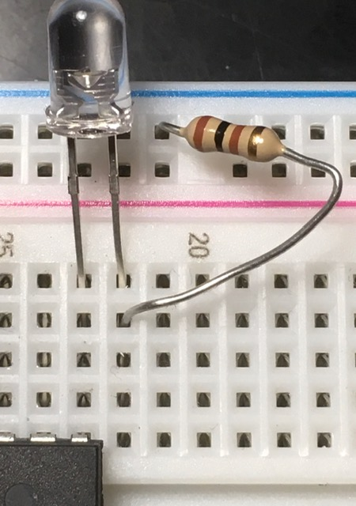

# AVR tutorial
Easy-to-grasp, step-by-step tutorials for creating firmware for the AVR family of microprocessors.

## Season 1, Lesson 1: You light up my life

### What you'll need

1. Everything in [Lesson 0](00-00-lab-setup.md).
1. A light emitting diode, or LED.
1. A resistor to protect the LED from the full current of the power supply.

Please note that you really do want to protect your LEDs. LEDs may be cheap (hopefully you're not using some expensive 5 W LED that turns night into day for this), but it's all too easy to burn out an LED, only to find you've burned through your entire stash. (Burning out components is part of the learning curve for EEs, so don't fret when you do it.) If you purchased yours, they should come with some specs on the package. All you need is to divide the difference between the supplied voltage and LED's forward voltage by the LED's forward current (in amps). There are also free LED resistor calcuators you can search for; I like [ledcalculator.net](https://ledcalculator.net) for its simplicity and completeness. If you pulled your LED out of some derelict device or just don't know its specs, toss in a low-ohm resistor -- you still want it to light.

LEDs are semiconductors that normally allow current in one direction -- that's what makes them diodes. It's essential to remember that they must be connected the right direction in order to do their job. If you look closely at the LED, you'll see that one lead ends in a larger plate than the other. The larger plate goes to the negative side of the power source.

|Positive||Negative|
|--|--|--|

### Setup
#### Hardware
1. Do everything in [Lesson 0](00-00-lab-setup.md).
1. Grab your LED and insert its leads between the PB1 pin on the processor (pin 15 on the ATmega88) and the adjacent unused hole on the breadboard (but not a power rail). Check which way the LED is facing -- the lead from the smaller piece of metal goes to PB1 on the chip.
1. Stick the resistor between the LED and the negative power rail. 

Your breadboard should look something like this:

#### Firmware
Yes, that's right. Software is what code written for the desktop, web sites, and mobile apps is turned into. Firmware is what the black magic awesomeness you're about to write gets compiled into, destined for uploading (or flashing) to run on an actual chip -- without all that mucking about with runtime interpreters or operating systems. This is the big time, my friend.
1. Download the code from [Code 01-01](../code/01-01.c) and save it to a convenient directory. Take a look at the code. This one's simple and commented, but you should start to get a feel for how it's done.
1. Open a Terminal in the directory holding the code. Oh yes, a Terminal. No wimpy IDEs or childish GUIs for you, you're going hard core unto the breach. Don't worry, you got this.
1. Enter the following to compile your C file:  
`avr-gcc -g -Os -mmcu=atmega88 -c 01-01.c`
1. Assuming all went well, you won't see anything but a new prompt appear. Now do the linking:  
`avr-gcc -g -mmcu=atmega88 -o 01-01.elf 01-01.o`
1. Again if all went well, you won't see anything but a new prompt appear. Now turn it into a flashable binary:  
`avr-objcopy -j .text -j .data -O ihex 01-01.elf 01-01.hex`
1. Finally, make sure BisPirate and your breadboard are connected and powered. Flash the firmware:  
`sudo avrdude -c buspirate -P /dev/ttyUSB0 -p m88p -U flash:w:01-01.hex`
1. After the [blinkenlights](https://en.wikipedia.org/wiki/Blinkenlights) are finished on BusPirate and you see `avrdude done.  Thank you` in the Terminal, you should be able to run the program. Power the breadboard and the LED should light, but not just because you applied power -- the chip is running your code, which is lighting the LED. Your code actually changed something in the physical world!

### More about the firmware
Even those familiar with C (albeit on the desktop) might find a few things odd in the code. Let's clear up some questions.

* `#include <avr/io.h>` is the header file that makes our AVR coding life easier.

The following preprocessor directives, again, make our life easier:

* `#define SETBIT(ADDRESS,BIT) (ADDRESS |= (1<<BIT))` turn a bit on, or *set* it (since T|T = F|T = T)
* `#define CLEARBIT(ADDRESS,BIT) (ADDRESS &= ~(1<<BIT))` turn a bit off, or *clear* it (T&F = F&F = F)
* `#define CHECKBIT(ADDRESS,BIT) (ADDRESS & (1<<BIT))` check the state of a bit (returns T&T = T or T&F = F)

Using the preprocessor "functions" to set up the LED:

* `SETBIT(DDRB, PINB1);` set the Data Direction of Port B, Pin 1 to output
* `SETBIT(PORTB, PINB1);` set Port B, Pin 1 to turn on LED
  
  
Now it's time to move on to the [next lesson](01-02-LED-button.md)!

As always, please send questions, corrections, and/or snide remarks to xenloops at protonmail dot com or @xenloops on Twitter.

