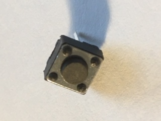
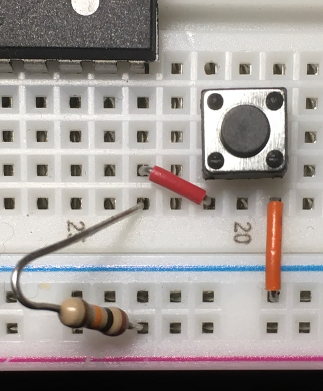

# AVR tutorial
Easy-to-grasp, step-by-step tutorials for creating firmware for the AVR family of microprocessors.

## Season 1, Lesson 2: Keep pushing my buttons

### What you'll need

1. Everything in [Lesson 1](01-01-LED-light.md).
1. A normally open (NO) pushbutton switch.
1. Another resistor; I used a 10 kilohm one, something to decrease the current flowing to the chip.

A pushbutton, as you know, is a momentary switch that makes a connection when pressed (NO), or released (normally closed, NC), to close or open a circuit. They're everywhere: calculators, keyboards, vehicles, even doorbells. We're going to use one to allow a voltage to one pin on the processor, and when the chip "sees" the signal, it will light the LED.

Yes, yes, this would be simpler to do without the chip -- if all you wanted was a switch to light an LED. But we're not building a flashlight, we're building the future.

### Setup
#### Hardware
1. Do everything in [Lesson 1](01-01-LED-light.md).
1. Connect one side of the switch to PB0 (Pin 14 on the ATMega88), and the other side to the negative power rail.
1. Connect the resistor between PB0 and the positive power rail.

Your breadboard should look something like this:

#### Firmware
1. Download the code from [Code 01-02](../code/01-02.c) and save it to your AVR development directory. Take a look at the code. This one is also simple and commented; pay special attention to how the button is set up.
1. Open a Terminal in the directory holding the code.
1. Enter the following to compile your C file:  
`avr-gcc -g -Os -mmcu=atmega88 -c 01-02.c`
1. Assuming all went well, you won't see anything but a new prompt appear. Now do the linking:  
`avr-gcc -g -mmcu=atmega88 -o 01-02.elf 01-02.o`
1. Again if all went well, you won't see anything but a new prompt appear. Now turn it into a flashable binary:  
`avr-objcopy -j .text -j .data -O ihex 01-02.elf 01-02.hex`
1. Finally, make sure BisPirate and your breadboard are connected and powered. Flash the firmware:  
`sudo avrdude -c buspirate -P /dev/ttyUSB0 -p m88p -U flash:w:01-02.hex`
1. After BusPirate finishes, you should be able to run the program. Power the breadboard and press the button. The LED should light, but not just because you pressed the button -- the chip saw that you pressed the button, and ran that part of your code that handles the putton press, which is lighting the LED. 

Not bad, not bad. But that's a lot of work to only have a glorified flashlight to show. Let's try something a bit different...

### What you'll need
Everything you already set up for this lesson.

### Setup
#### Hardware
No changes from the first part.

#### Firmware
1. Download the code from [Code 01-02 Rev A](../code/01-02a.c) and save it to your AVR development directory. Take a look at the code. This one is also simple and commented; pay special attention to differences in the behavior from the code in the first part.
1. Enter the same commands as before, replacing "01-02" with "01-02a".
1. Power the breadboard and press the button. Then press it again. And again. Try holding it down. Pretty cool, eh? But, it's a little glitchy, you'll find. We'll fix that next.

You could modify the behavior further, e.g. to make it light every third time you press the button. Or randomize how many button presses it takes before the LED lights. Surprise your friends, fool your enemies.

### More about the firmware
Some additional code is needed to handle the button's functionality:

* `CLEARBIT(DDRB, PINB0);` set the Data Direction on Port B, Pin 0 to input
* `SETBIT(PORTB, PINB0);` activate the internal pull-up resistor on Port B, Pin 0
* `if (!CHECKBIT(PINB, PINB0))` check if the button is pressed

The second version introduces a primitive delay function:

* `#define F_CPU 1000000UL` specify what speed the chip is running
* `#include <util/delay.h>` use the delay header file
* `#define WAIT(ms); _delay_ms(ms)` simplify calling the `_delay_ms()` function
* `WAIT(100);` stop processing for 0.1 second

Now it's time to move on to the [next lesson](01-03-LED-button-interrupt.md) (if not available yet, keep your eyes open)!

As always, please send questions, corrections, and/or snide remarks to xenloops at protonmail dot com or @xenloops on Twitter.

