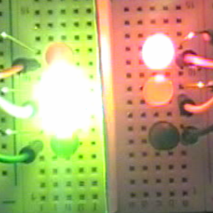
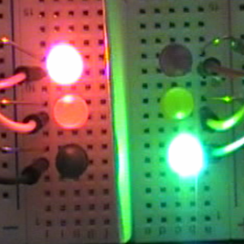

# AVR tutorial
Easy-to-grasp, step-by-step tutorials for creating firmware for the AVR family of microprocessors.

## Season 1, Lesson 5: Traffic lights

||||

### What you'll need

1. Everything in [Lesson 0](00-00-lab-setup.md). That's right, we're going back to the beginning for this lesson. Rip out the LED, button, and resistor. Gently.
1. Six LEDs: two each of red, yellow, and green. (Really the colors don't matter, except that we're building traffic lights -- and we don't wish to confuse people with purple lights, now do we? Granted, they would look cool.)
1. Six resistors as appropriate to protect the LEDs from the full current of the power supply.

If you're stuck with plain white LEDs and don't wish to wait for an order, fear not. Tempora paint does nicely. Just dip an LED in the desired color, let it air dry, and use normally.

### Setup
#### Hardware
1. Do everything in [Lesson 0](00-00-lab-setup.md). 
1. Position each of the LEDs on the breadboard to look like two sets of traffic lights.
1. Add a resistor between the positive side of each LED and the positive rail (just to mix it up a bit). Alternately, you can connect all LEDs to a single resistor to the positive rail.
1. Use jumper wires to connect the negative sides of the LEDs to their respective pins on the chip. The pin assignments are arbitrary, but if you change any of them (or are using a chip other than the ATmega88) be sure to change the code accordingly. The code is set up for this wiring:

|LED color|Pin name|ATmega88 pin|
|--|--|--|
| Red 1  | PD5 | 11 |
| Yellow 1  | PD6 | 12 |
| Green 1  | PD7 | 13 |
| Red 2  | PB3 | 17 |
| Yellow 2  | PB2 | 16 |
| Green 2  | PB1 | 15 |

#### Firmware
1. Download the code from [Code 01-05](../code/01-05.c) and save it to your AVR development directory. Take a look at the code, paying attention to the setup of the constants and the timing in the while loop. This code is also simple and commented.
1. Open a Terminal in the directory holding the code.
1. As in previous lessons, enter the following commands in order: 

   `avr-gcc -g -Os -mmcu=atmega88 -c 01-05.c`

   `avr-gcc -g -mmcu=atmega88 -o 01-05.elf 01-05.o`

   `avr-objcopy -j .text -j .data -O ihex 01-05.elf 01-05.hex`

   `sudo avrdude -c buspirate -P /dev/ttyUSB0 -p m88p -U flash:w:01-05.hex`

As soon as the firmware is finished being flashed, the LEDs should begin flashing in the correct sequence, just faster than you'd expect for a standard traffic light in the U.S.

### More about the firmware
We could use a timer interrupt to do the work here as well, but because switching the LEDs on and off in sequence is all the processor is doing, there is no real need for that. However, if you want to do all that mucking about with interrupts for this, go right ahead; it's good practice.

Now it's time to move on to the [next lesson](01-06-LED-PWM-pulse.md) (if not available yet, keep your eyes open)!

As always, please send questions, corrections, and/or snide remarks to xenloops at protonmail dot com or @xenloops on Twitter.

